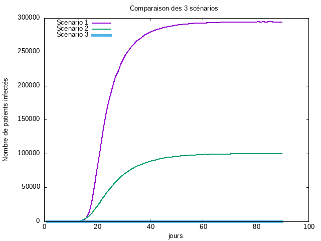

# TP Mesures de réseaux d'interaction
***
# Introduction
Nous allons analyser un réseau de collaboration scientifique en informatique. Le réseau est extrait de DBLP(c'est une bibliographie informatique qui fournit une liste complète des articles de recherche en informatique) et disponible sur [SNAP](https://snap.stanford.edu/data/com-DBLP.html).

GraphStream permet de mesurer de nombreuses caractéristiques d'un réseau. La plupart de ces mesures sont implantées comme des méthodes statiques dans la classe [Toolkit](https://data.graphstream-project.org/api/gs-algo/current/org/graphstream/algorithm/Toolkit.html).

# Lecture des données avec GraphStream
Pour commencer tout d'abord on doit télécharger les données au nom de fichier : _com-dblp.ungraph.txt_ qui contient les données de DBLP. GraphStream a su lire ce format après l'instanciation de *FileSourceEdge()*, et via la fonction *readAll()* , l'integralité du fichier est lu en une seule instruction.

# Les Mesure de base du réseau :
D'après les méthodes qui existante dans GraphStream on prend quelques mesures de base: nombre de nœuds et de liens, degré moyen, coefficient de clustering et le coefficient de clustering pour un réseau aléatoire de la même taille et du même degré moyen.
## 1-Le nombre de noeud :
Pour trouver le nombre de noeuds de notre graphe en question j'ai utilisé la fonction *getNodeCount()* de la classe Toolkit.
## 2- Le nombre de liens :
Pour trouver le nombre de liens de notre graphe j'ai utilisé la fonction *getEdgeCount()*.
## 3- Le degré moyen :  
Pour trouver le degré moyen de notre graphe j'ai utilisé la fonction *averageDegree()* de la classe Toolkit.
## 4- Le coefficient de clustering :
Pour trouver le coefficient de clustering qui est la moyenne du coefficient de clustering de tous les sommets qui ont un degré supérieur ou égal à 2  de notre graphe j'ai utilisé la fonction averageClusteringCoefficient() de la classe Toolkit.
## 5- le coefficient de clustering pour un réseau aléatoire de la même taille et du même degré moyen :
Dans ce cas un réseau aléatoire *G(N,p)* contient *N* noeuds et la probabilité *P* que chaque paire de noeud soit reliée, est la même pour toute paire de noeuds.

*Ci = P* => **6.62208890914917/ 317080 = 2.0884599814397534E-5**  
Ce résultat a été obtenu grâce a la méthode *averageDegree(graph) / graph.getNodeCount()*  
et on a obtenu les résultats comme ce ci

# La connexité 
## 1- Un réseau connexe : 
Un réseau connexe c'est un réseau dont tous les noeuds sont connectés entres eux et pour la vérifier sur notre graphe j'ai utiliser la fonction de *isConnected()* qui renvoit vrai si le réseau est connexe si non faux. et après avoir utiliser la méthode *isOriented()* le réseau DBLP est connexe.
## 2- réseau aléatoire de la même taille et degré moyen sera-t-il connexe: 
On sait que le réseau aléatoire de la même taille et degré moyen soit connexe si la notion du degré est supérieur au nombre de noeuds du graphe est vérifie 
  Soit `〈k〉> lnN(p>lnN/N)`    
après appliquer ça on déduit que même si dans un réseau aléatoire malgré la même taille et degré moyen  
ce dernier n'est pas connexe.
## 3- À partir de quel degré moyen un réseau aléatoire avec cette taille devient connexe :
Un réseau aléatoire avec cette même taille devient connexe si le degré moyen est supérieur à  **12.666909386951092**  

# La distribution des degrés :
La distribution des degrés est la probabilité qu'un nœud choisi au hasard ait degré k.
  Soit `P(k) = N(k)/N`  
pour se faire j'ai fait appel à la fontion *Toolkit.degreeDistribution(notre graphe)* qui renvoit un tableau où chaque indice de cellule représente le degré, et la valeur de la cellule le nombre de noeud ayant ce degré, et puis j'ai stocké le résultat obtenu dans un tableau d'entiers degreProba[]
et puis j'ai créé un fichier texte ou chaque ligne représente l'association de la probabilité qu'un noeud choisi au hasard ait degré `k` à son degré `k`.

Alors à partir du fichier générer `distributionDegre.txt` contenant la distribution des degrés, on trace le graphe correspondant à la probabilité qu’un noeud choisi au hasard ait degré `k` en fonction de son degré `k`.
On commençant avec l'échelle linéaire puis l'échelle log log.  

## 1- Échelle linéaire :

Pour le générer j'ai utilisé ce [script](Distribution/DistributionDegreEchelleLineaire.gnuplot)

## 2- Échelle log-log :

Pour le générer j'ai utilisé ce [Script](Distribution/DistributionDegreEchelleLogLog.gnuplot)

En analysant le graphe on peut voir une ligne droite pendant plusieurs ordres de grandeur. Donc on déduit que la distribution de degré suit une loi de puissance.

## 3- La loi de poisson 
Pour le générer j'ai utilisé ce [Script](Distribution/DistributionDePoisson.gnuplot)

## 4- La loi de puissance 
Afin de générer la loi de puissance que suit cette distribution, on a utiliser le même principe, via l'outil Gnuplot nous avons obtenu grace au [script](Distribution/LoiDePuissance.gnuplot) le graphe suivant :

# La distance 
La distance entre deux noeuds d'un graphe est la longueur d'un plus court chemin (la longueur d'un chemin est sa longueur en nombre d'arrêtes), entre ces deux noeuds. 
Pour trouver la distance moyenne de notre échantillon de 1000 noeuds, elle prend 1000 noeuds du réseau au hasard
puis on fait la somme de ses distances vers les autres noeuds du graphe.

Et on obtient ce résultat : **6.7938152705941715**.

Donc graçe à la distance moyenne on peut dire que l'hypothèse de six degrés de séparation est confirmé.

Puisque la distance entre deux noeuds choisis au hasard est courte donc il s'agit d'un réseau "petit monde".

Nous obtenons le résultat de la distance moyenne calculée pour 1000 noeuds choisis au hasard comme ceci : **6.700611818856679** .

Les résultats obtenus sont stockés dans le fichier  [Distance](Distribution/Distance.txt) .  
Ces résultats sont tracés via Gnuplot grâce à ce [script](Distribution/distributionDistances.gnuplot) .  

Ce qui nous mène au graphe suivant

Dans la courbe obtenue on déduit que cette distribution suit une loi Binomiale car on observe que selon les données du sommet on peut remarquer qu'il s'agit de la même distance que partage plusieurs noeuds.
# Générateurs de GraphStream 

## 1- Générer un réseau aléatoire
Pour générer le graphe en utilisant le générateur aléatoire de graphe et on reprend les meme mesures des questions précédentes.
j'ai créé la méthode *genererGraphRandom(int nbNoeuds, int degreeMoyen)* qui prend deux paramétre le nombre de noeuds du graphe et le degré moyen.
et on obtient les mesures suivantes :

Et avec les memes scripts qu'on a deja fait on va tracer la distribution des degrés en échelle linéaire puis en log-log et aussi la distribution de poisson et la loi de puissance.
Et on obtient ces résultats :

## 2- Générer un réseau avec la méthode d'attachement préférentiel (Barabasi-Albert)
Pour générer le graphe en utilisant le générateur avec la méthode d'attachement préférentiel (Barabasi-Albert) 
j'ai créé la méthode **BarabasiAlbert(int nbNoeuds, int degreeMoyen)** qui prend deux paramétre le nombre de noeuds du graphe et le degré moyen.
et on obtient les mesures suivantes :

Et avec les memes scripts qu'on a deja fait on va tracer la distribution des degrés en échelle linéaire puis en log-log et aussi la distribution de poisson et la loi de puissance.
Et on obtient ces résultats :

En effet, Les résultats expérimentaux correspondent aux prédictions théoriques.

## 3- Comparaison
D'après les résultats on voit que le graphe préférentiel à plus de liens, et on voit que le graphe aléatoire possède le plus faible coefficient de clustering.
De plus le graphe préférentiel intègre deux concepts généraux importants : la croissance(le nombre de noeuds dans le réseau augmente avec le temps) et
l'attachement préférentiel (plus un noeud est connecté, plus il est susceptible de recevoir de nouveaux liens). Et ces deux concepts existent dans les réseaux réels.

***

# TP Propagation dans des réseaux

***

# Introduction 

La propagation dans un réseau est l'étude de la manière dont une information, une influence ou une maladie se propage à travers les différents noeuds d'un réseau. 
Il existe différents modèles pour étudier la propagation dans les réseaux, utilisés pour étudier les dynamiques d'épidémies, les phénomènes de rumeur, 
les tendances de l'opinion, les phénomènes de diffusion de l'innovation, les comportements de consommation, etc. 
Ces modèles peuvent être utilisés pour étudier différents aspects de la propagation dans les réseaux, comme la vitesse de propagation, la taille de l'épidémie, 
les noeuds les plus vulnérables, les stratégies de contrôle de la propagation, etc.
***
Dans ce Tp Nous utilisons les mêmes consignes que le TP précédent ainsi que les données vu que la problèmatique est assez proche d'où le même dépôt git.
Les collaborateurs scientifiques communiquent souvent par mail. Malheureusement pour eux, les pièces jointes de ces mails contiennent parfois des virus informatiques. On va étudier la propagation d'un virus avec les hypothèses suivantes :
- Un individu envoie en moyenne un mail par semaine à chacun de ses collaborateurs.
- Un individu met à jour son anti-virus en moyenne deux fois par mois. Cela nettoie son système mais ne le protège pas de nouvelles infections car le virus mute.
- L'épidémie commence avec un individu infecté (patient zéro).
## 1 - Le taux de propagation du virus :
Le taux de propagation d'un virus est une mesure de la rapidité avec laquelle le virus se propage à travers un groupe d'individus. Il est calculé en divisant 
la probabilité de transmission du virus par unité de temps par la probabilité de guérison des individus infectés. 
Dans ce cas particulier, on suppose que les collaborateurs s'envoient en moyenne un mail par semaine, ce qui donne une probabilité de transmission de 1/7.  
On suppose également qu'un individu met à jour son antivirus en moyenne 2 fois par mois, ce qui donne une probabilité de guérison de 1/14.  
En utilisant ces informations, le taux de propagation du virus est calculé comme étant 2.

## 2 - Le seuil épidémique du réseau :
Il est crucial de comprendre comment une épidémie se propage afin de prévoir jusqu'où elle peut se propager. C'est pourquoi le seuil épidémique est important, il permet de déterminer si une épidémie peut s'emballer ou non. Pour cela, il est nécessaire de calculer le seuil épidémique pour le réseau en question.  
On peut le calculer en utilisant la formule `Sλ = <k> / <k²>`, où `<k>` est le degré moyen du réseau et `<k²>` est la dispersion des degrés.  
Si le taux de propagation `λ` est supérieur au seuil épidémique `Sλ`, l'épidémie se poursuit, sinon elle s'abstient.

## 3 - comparaison avec le seuil théorique d'un réseau aléatoire du même degré moyen :
Nous avons obtenu ces résultats, qui montrent que le seuil épidémique d'un réseau aléatoire au même degré moyen est d'environ `0.13119762993051035`, ce qui est plus élevé que celui du réseau DBLP. Cette différence est due à la divergence du degré de clustering.

***
# Simulation de la propagation du virus jour par jour pendant trois mois avec trois scénarios différent : 

## 1 - Scénario 01
La Simulation sur la propagation du virus jour par jour pendant trois mois avec le premier scénario lorsqu'on ne fait rien pour empêcher l'épidémie.
pour ce faire La méthode "simulateScenario1" simule la propagation d'un virus pendant 3 mois (90 jours) en utilisant un graphe pour représenter les relations entre les individus.
Elle prend en entrée un graphe et renvoie un résultat sous forme de chaîne de caractères. 
Elle définit un patient zéro au hasard, qui est le premier infecté, et ajoute l'attribut "infecté" à ce noeud. 
Elle boucle ensuite sur le nombre de jours de la simulation et pour chaque jour : pour chaque noeud infecté, 
elle calcule la probabilité de transmettre le virus à ses voisins (1/7) et si cette probabilité est vérifiée, 
elle ajoute l'attribut "infecté" à ses voisins et incrémente le compteur de personnes infectées.
Elle vérifie également pour chaque noeud s'il guérit (1/14) et si c'est le cas, elle retire l'attribut "infecté" et décrémente le compteur de personnes infectées. 
Elle affiche le nombre de personnes infectées pour chaque jour et renvoie le résultat sous forme de chaîne de caractères.
Et puis à l'aide de la méthode saveData j'ai pu enregistré les données obtenus et les stocker dans un fichier [Scenario1](TpPropagation/Scenario1.dat). 
Ces résultats sont tracés via Gnuplot grâce à ce [script](TpPropagation/scenario1.gnuplot) .  

Ce qui nous mène au graphe suivant

On remarque qu'au cours des 30 premiers jours, l'augmentation de la propagation du virus est très importante, atteignant environ 280 000 cas d'infections, puis la courbe devient stable jusqu'à la fin de la simulation.
***
## 2 - Scénario 02
La méthode "simulateScenario2" simule la propagation d'un virus pendant 90 jours (3 mois) dans un graphe de collaborateurs en utilisant un scénario de simulation
où 50% des collaborateurs sont immunisés (ils ont mis à jour en permanence leur anti-virus). 
Elle commence par sélectionner aléatoirement la moitié des employés pour les immuniser,
puis choisit un patient zéro (le premier infecté) au hasard parmi les collaborateurs non immunisés.
Ensuite, pour chaque jour de la simulation, elle parcourt tous les collaborateurs infectés et calcule 
la probabilité de 1/7 de propager le virus à leurs voisins, en excluant les collaborateurs immunisés. 
Elle utilise également une probabilité de 1/14 pour vérifier si les collaborateurs infectés guérissent ou non.
Enfin, elle renvoie le résultat sous forme de chaîne de caractères. 
Et puis à l'aide de la méthode saveData j'ai pu enregistré les données obtenus et les stocker dans un fichier [Scenario2](TpPropagation/Scenario2.dat). 
Ces résultats sont tracés via Gnuplot grâce à ce [script](TpPropagation/scenario2.gnuplot) .  

Ce qui nous mène au graphe suivant

On constate que la propagation du virus débute le 15ème jour, atteignant environ 100000 cas d'infection, avant de se stabiliser jusqu'à la fin de la simulation.

***
## 3 - Scénario 03
La méthode "simulateScenario3" simule la propagation d'un virus pendant 90 jours (3 mois) dans un graphe de collaborateurs en utilisant un scénario de simulation
où 50% des individus ont réussi à convaincre un de leurs contacts de mettre à jour en permanence son anti-virus (immunisation sélective). 
Le graphe est initialisé en mettant tous les noeuds dans l'état "sain" (pas infecté).
Ensuite, un des contacts de chaque individu dans le groupe de 50% est sélectionné aléatoirement et est mis à jour en permanence, devenant "immunisé". 
Ensuite, un individu infecté (patient 0) est sélectionné aléatoirement parmi les individus immunisés. 
Chaque jour, les individus infectés propagent le virus à leurs voisins avec une probabilité de 1/7. 
Les individus infectés ont également une probabilité de 1/14 de guérir chaque jour.
Le nombre d'individus infectés est enregistré chaque jour et est retourné en résultat final. 
Et puis à l'aide de la méthode saveData j'ai pu enregistré les données obtenus et les stocker dans un fichier [Scenario3](TpPropagation/Scenario3.dat). 
Ces résultats sont tracés via Gnuplot grâce à ce [script](TpPropagation/scenario3.gnuplot) .  

Ce qui nous mène au graphe suivant

On constate que le nombre de personnes infectées est très faible par rapport aux autres scénarios pendant la durée de la simulation. 
***
voici un graphe qui compare les trois scénarios au meme temps

