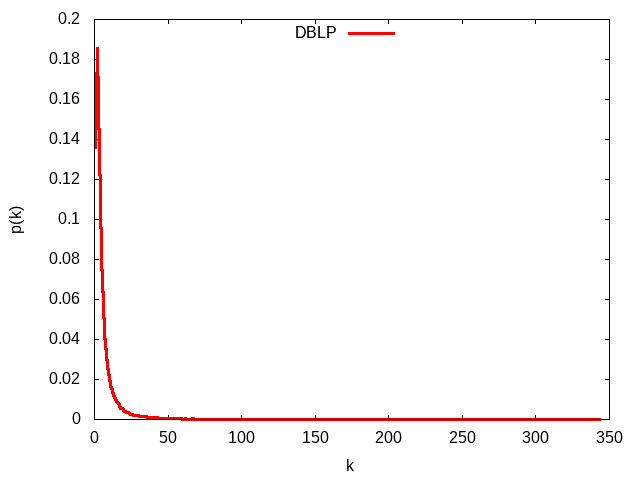
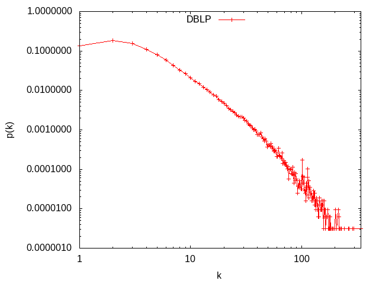

# TP Mesures de réseaux d'interaction
***
# Introduction
Nous allons analyser un réseau de collaboration scientifique en informatique. Le réseau est extrait de DBLP(c'est une bibliographie informatique qui fournit une liste complète des articles de recherche en informatique) et disponible sur [SNAP](https://snap.stanford.edu/data/com-DBLP.html).

GraphStream permet de mesurer de nombreuses caractéristiques d'un réseau. La plupart de ces mesures sont implantées comme des méthodes statiques dans la classe [Toolkit](https://data.graphstream-project.org/api/gs-algo/current/org/graphstream/algorithm/Toolkit.html).

# Lecture des données avec GraphStream
Pour commencer tout d'abord on doit télécharger les données au nom de fichier : _com-dblp.ungraph.txt_ qui contient les données de DBLP. GraphStream a su lire ce format après l'instanciation de *FileSourceEdge()*, et via la fonction *readAll()* , l'integralité du fichier est lu en une seule instruction.

# Les Mesure de base du réseau :
D'après les méthodes qui existante dans GraphStream on prend quelques mesures de base: nombre de nœuds et de liens, degré moyen, coefficient de clustering et le coefficient de clustering pour un réseau aléatoire de la même taille et du même degré moyen.
## 1-Le nombre de noeud :
Pour trouver le nombre de noeuds de notre graphe en question j'ai utilisé la fonction *getNodeCount()* de la classe Toolkit.
## 2- Le nombre de liens :
Pour trouver le nombre de liens de notre graphe j'ai utilisé la fonction *getEdgeCount()*.
## 3- Le degré moyen :  
Pour trouver le degré moyen de notre graphe j'ai utilisé la fonction *averageDegree()* de la classe Toolkit.
## 4- Le coefficient de clustering :
Pour trouver le coefficient de clustering qui est la moyenne du coefficient de clustering de tous les sommets qui ont un degré supérieur ou égal à 2  de notre graphe j'ai utilisé la fonction averageClusteringCoefficient() de la classe Toolkit.
## 5- le coefficient de clustering pour un réseau aléatoire de la même taille et du même degré moyen :
Dans ce cas un réseau aléatoire *G(N,p)* contient *N* noeuds et la probabilité *P* que chaque paire de noeud soit reliée, est la même pour toute paire de noeuds.

*Ci = P* => **6.62208890914917/ 317080 = 2.0884599814397534E-5**  
Ce résultat a été obtenu grâce a la méthode *averageDegree(graph) / graph.getNodeCount()*  
et on a obtenu les résultats comme ce ci

# La connexité 
## 1- Un réseau connexe : 
Un réseau connexe c'est un réseau dont tous les noeuds sont connectés entres eux et pour la vérifier sur notre graphe j'ai utiliser la fonction de *isConnected()* qui renvoit vrai si le réseau est connexe si non faux. et après avoir utiliser la méthode *isOriented()* le réseau DBLP est connexe.
## 2- réseau aléatoire de la même taille et degré moyen sera-t-il connexe: 
On sait que le réseau aléatoire de la même taille et degré moyen soit connexe si la notion du degré est supérieur au nombre de noeuds du graphe est vérifie 
  Soit `〈k〉> lnN(p>lnN/N)`    
après appliquer ça on déduit que même si dans un réseau aléatoire malgré la même taille et degré moyen  
ce dernier n'est pas connexe.
## 3- À partir de quel degré moyen un réseau aléatoire avec cette taille devient connexe :
Un réseau aléatoire avec cette même taille devient connexe si le degré moyen est supérieur à  **12.666909386951092**  

# La distribution des degrés :
La distribution des degrés est la probabilité qu'un nœud choisi au hasard ait degré k.
  Soit `P(k) = N(k)/N`  
pour se faire j'ai fait appel à la fontion *Toolkit.degreeDistribution(notre graphe)* qui renvoit un tableau où chaque indice de cellule représente le degré, et la valeur de la cellule le nombre de noeud ayant ce degré, et puis j'ai stocké le résultat obtenu dans un tableau d'entiers degreProba[]
et puis j'ai créé un fichier texte ou chaque ligne représente l'association de la probabilité qu'un noeud choisi au hasard ait degré `k` à son degré `k`.

Alors à partir du fichier générer `distributionDegre.txt` contenant la distribution des degrés, on trace le graphe correspondant à la probabilité qu’un noeud choisi au hasard ait degré `k` en fonction de son degré `k`.
On commençant avec l'échelle linéaire puis l'échelle log log.  

## Échelle linéaire :

Pour le générer j'ai utilisé ce [script](Distribution/DistributionDegreEchelleLineaire.gnuplot)

## Échelle log-log :

Pour le générer j'ai utilisé ce [Script](Distribution/DistributionDegreEchelleLogLog.gnuplot)

En analysant le graphe on peut voir une ligne droite pendant plusieurs ordres de grandeur. Donc on déduit que la distribution de degré suit une loi de puissance.

## La loi de poisson 
Pour le générer j'ai utilisé ce [Script](Distribution/DistributionDePoisson.gnuplot)

## La loi de puissance 
Afin de générer la loi de puissance que suit cette distribution, on a utiliser le même principe, via l'outil Gnuplot nous avons obtenu grace au [script](Distribution/LoiDePuissance.gnuplot) le graphe suivant :

# La distance 
La distance entre deux noeuds d'un graphe est la longueur d'un plus court chemin (la longueur d'un chemin est sa longueur en nombre d'arrêtes), entre ces deux noeuds. 
Pour trouver la distance moyenne de notre échantillon de 1000 noeuds, elle prend 1000 noeuds du réseau au hasard
puis on fait la somme de ses distances vers les autres noeuds du graphe.

Et on obtient ce résultat : **6.7938152705941715**.

Donc graçe à la distance moyenne on peut dire que l'hypothèse de six degrés de séparation est confirmé.

Puisque la distance entre deux noeuds choisis au hasard est courte donc il s'agit d'un réseau "petit monde".

Nous obtenons le résultat de la distance moyenne calculée pour 1000 noeuds choisis au hasard comme ceci : **6.700611818856679** .

Les résultats obtenus sont stockés dans le fichier  [Distance](Distribution/Distance.txt) .  
Ces résultats sont tracés via Gnuplot grâce à ce [script](Distribution/distributionDistances.gnuplot) .  

Ce qui nous mène au graphe suivant

Dans la courbe obtenue on déduit que cette distribution suit une loi Binomiale car on observe que selon les données du sommet on peut remarquer qu'il s'agit de la même distance que partage plusieurs noeuds.
 